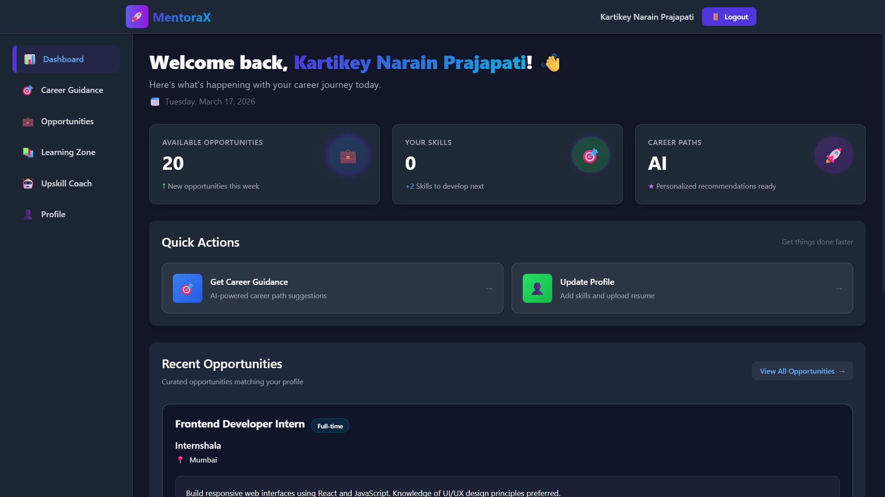
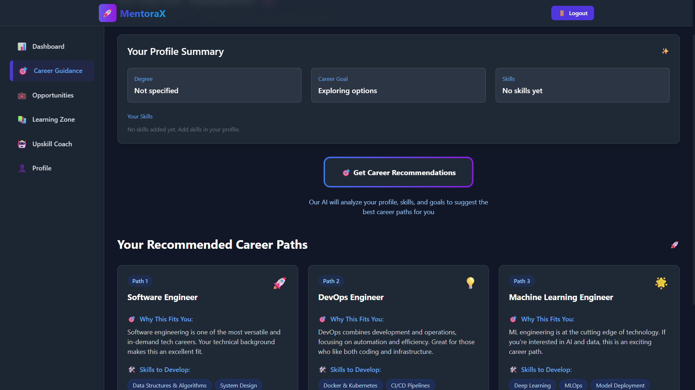
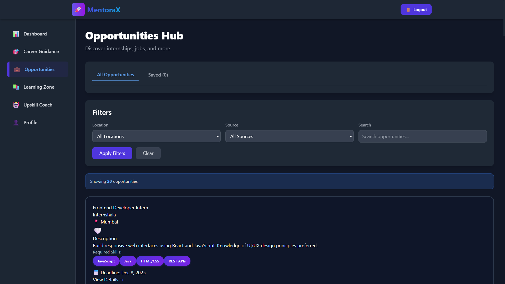
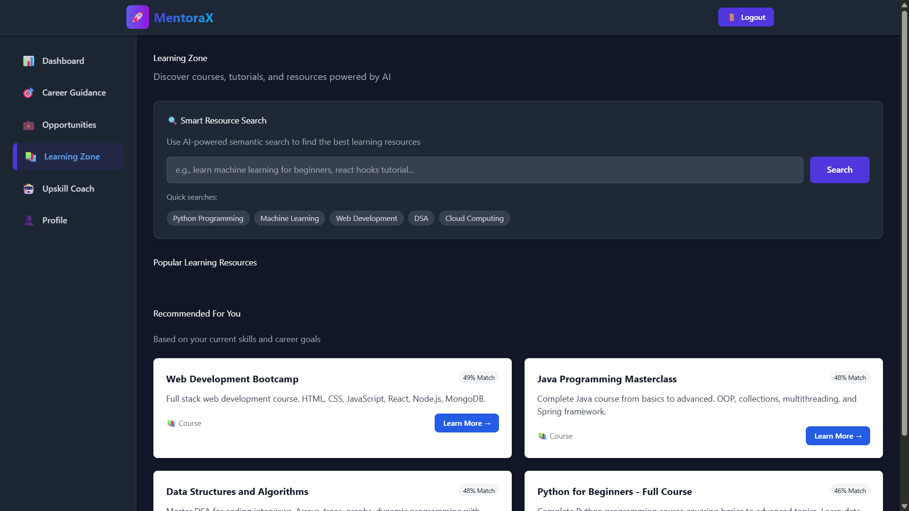
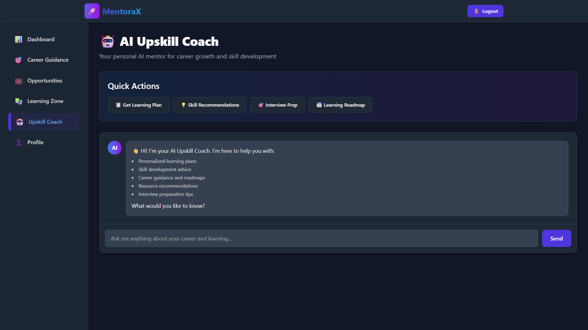
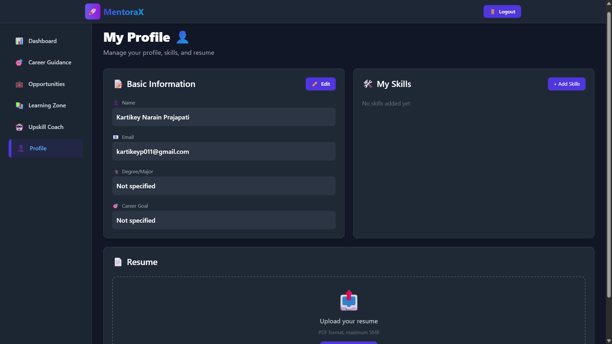

# **MentoraX - AI-Powered Career Guidance Platform**

An intelligent career guidance and upskilling platform for college students, powered by AI and machine learning. MentoraX helps students discover career paths, find opportunities, learn new skills, and get personalized mentorship based on their profiles.

---

## ✨ **Features**

### **🎯 AI Career Guidance**
- Personalized career path recommendations powered by Google Gemini AI
- Skill gap analysis comparing your profile against your career aspirations
- Context-aware suggestions based on your degree and goals

### **💼 Opportunities Hub**
- Real-time internship and job listings
- Advanced filtering by location, required skills, and deadlines
- Save and bookmark opportunities for later

### **📚 Learning Zone**
- AI-powered semantic search for courses and learning materials using FAISS
- Free and paid course recommendations
- Resource mapping to your missing skills

### **🤖 Upskill Coach**
- Interactive AI chatbot for instant career advice and mentorship
- Personalized learning plans generated on demand
- Real-time feedback on your queries

### **👤 Profile Management**
- Comprehensive skills portfolio with a 1-5 proficiency tracking system
- Seamless resume upload to secure AWS S3 cloud storage
- Progress tracking and learning statistics

---

## 📸 **Platform Preview**

*Add your project screenshots here:*

### **Dashboard Page**
> 

### **Career Guidance Page**
> 

### **Opportunities Hub**
> 

### **Learning Zone**
> 

### **AI Upskill Coach**
> 

### **Profile Page**
> 

---

## 🛠️ **Tech Stack**

- **Backend:** Python 3.11+, FastAPI, Uvicorn
- **Database:** MySQL 8.0+
- **AI/ML:** Google Gemini 2.0 Flash (Career & Coach logic), FAISS (Vector Semantic Search)
- **Frontend:** HTML5, Vanilla JavaScript, Tailwind CSS (via CDN)
- **Cloud Storage:** AWS S3 (for Resumes)
- **Authentication:** Custom session-based token authentication with SHA-256 password hashing

---

## 🚀 **Local Setup & Installation**

### **Prerequisites**
Before you begin, ensure you have the following installed and configured:
- **Python 3.11+** installed and added to your systemic PATH.
- **MySQL 8.0+** installed, running, and accessible.
- **Google Gemini API Key** (Get one from [Google AI Studio](https://aistudio.google.com/apikey)).
- **AWS Account** (Optional, but required if you want to test the Resume Upload feature).

### **Step-by-Step Installation**

#### 1. Clone the repository
```bash
git clone https://github.com/kartikeyp011/MentoraX.git
cd MentoraX
```

#### 2. Create and activate a Virtual Environment
It is highly recommended to isolate dependencies using a virtual environment.
```bash
# Create virtual environment
python -m venv venv

# Activate it (Windows)
venv\Scripts\activate

# Activate it (Linux/Mac)
source venv/bin/activate
```

#### 3. Install Python Dependencies
```bash
pip install -r requirements.txt
```

#### 4. Setup the MySQL Database
A setup script is provided to create the database (`MentoraX`), all required tables, and insert seed data (30+ common tech skills).

**Linux/Mac:**
```bash
mysql -u root -p < setup_db.sql
```

**Windows (PowerShell):**
```powershell
Get-Content "setup_db.sql" -Raw | mysql -u root -p
```
*(Enter your MySQL password when prompted)*

#### 5. Configure Environment Variables
In the root directory of the project, create or edit the `.env` file with your credentials:

```ini
# Core API Keys
GEMINI_API=your_gemini_api_key_here

# Database Configuration
MYSQL_HOST=127.0.0.1
MYSQL_USER=root
MYSQL_PASSWORD=your_mysql_password
MYSQL_DATABASE=MentoraX

# AWS Configuration (For Resume Uploads)
AWS_ACCESS_KEY_ID=your_aws_access_key
AWS_SECRET_ACCESS_KEY=your_aws_secret_key
AWS_S3_BUCKET_NAME=your_s3_bucket_name
```

#### 6. Load Sample Data (Optional but Recommended)
Load the sample job and internship opportunities into the database:
```bash
python backend/load_data.py
```

#### 7. Start the FastAPI Server
Run the application using Uvicorn:
```bash
uvicorn backend.main:app --host 127.0.0.1 --port 8000 --reload
```

**The application will now be available at:** [http://localhost:8000](http://localhost:8000)

*(Note: The `backend.main` automatically mounts and serves the static HTML/JS frontend files located in the `frontend` folder.)*

---

## 📖 **Platform Usage**

1. **Sign Up:** Navigate to `/signup` and create your profile. Fill in your degree and high-level career goals.
2. **Build Your Profile:** Go to `/profile` to add your current skills and specify your proficiency out of 5. You can also upload your resume here.
3. **Get AI Guidance:** Visit `/career-guidance` to let the AI analyze your profile and suggest 3 highly-tailored career paths, highlighting skills you need to build.
4. **Browse Opportunities:** Go to `/opportunities` to view live internships and jobs. Bookmark the ones you like.
5. **Chat with the Coach:** Visit `/upskill-coach` to talk to entirely customized AI mentor that knows your background and goals. Try asking it "Create a 3-month learning plan for me".

---

## 📚 **API Endpoints Reference**

MentoraX provides a completely documented Swagger UI for its endpoints. Once the server is running, visit **[http://localhost:8000/docs](http://localhost:8000/docs)** for interactive API documentation.

### Core Modules:
- **`POST /auth/*`**: User registration, login, logout, and token verification.
- **`POST /career/*`**: AI-powered career path generation and skill gap analysis.
- **`GET /opportunities/*`**: Fetching, filtering, and bookmarking jobs.
- **`POST /resources/*`**: FAISS semantic search for fetching learning resources.
- **`POST /coach/*`**: UpSkill coach chat, suggestions, and learning plan generation.
- **`GET /user/*`**: Profile fetching, updating, and S3 resume uploads.

---

## 📁 **Project Architecture**

```text
MentoraX/
├── backend/
│   ├── auth.py              # Authentication
│   ├── career.py            # Career guidance (Gemini)
│   ├── coach.py             # AI UpSkill chatbot
│   ├── database.py          # MySQL connector pooling
│   ├── faiss_utils.py       # Vectorized search algorithms
│   ├── load_data.py         # JSON to MySQL seed loader
│   ├── main.py              # FastAPI entry point & routers
│   ├── models.py            # Pydantic schemas (FastAPI validation)
│   ├── opportunities.py     # Job listings logic
│   ├── profile.py           # S3 Uploads and user management
│   ├── resources.py         # Learning resources 
│   ├── scraper.py           # Main scraping logic
│   └── scraper_utils.py     # Job board scraping infrastructure
├── frontend/
│   ├── *.html               # Main Web Pages (Dashboard, Profile, Login)
│   └── js/                  # Page-specific frontend logic (*.js)
├── data/
│   ├── opportunities.json   # Seed data
│   └── faiss_indexes/       # Local vector search indexes
├── setup_db.sql             # Full database DDL definition script
├── .env                     # Secrets configuration
└── requirements.txt         # Core dependencies
```

---

## 📄 **License**

This project is licensed under the MIT License.

---

## 📧 **Contact & Support**

- **Repository:** [github.com/kartikeyp011/MentoraX](https://github.com/kartikeyp011/MentoraX)